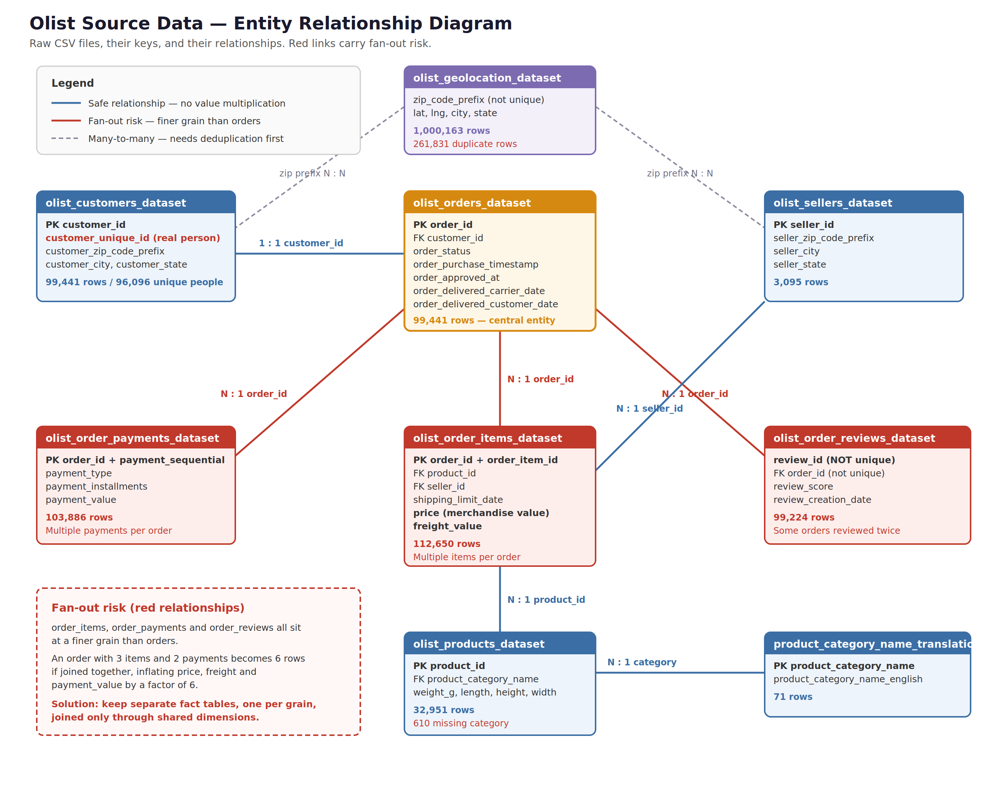
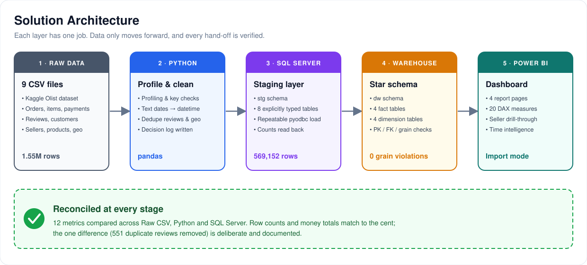
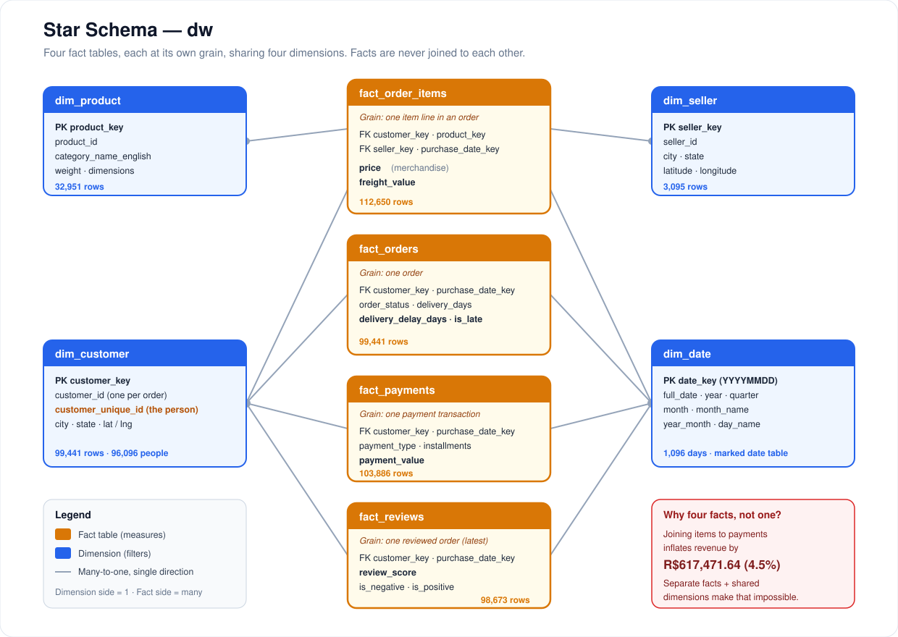
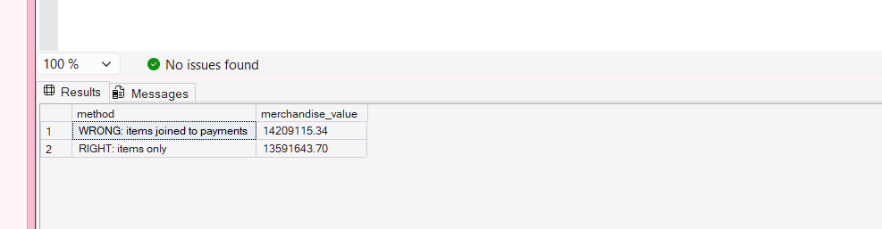
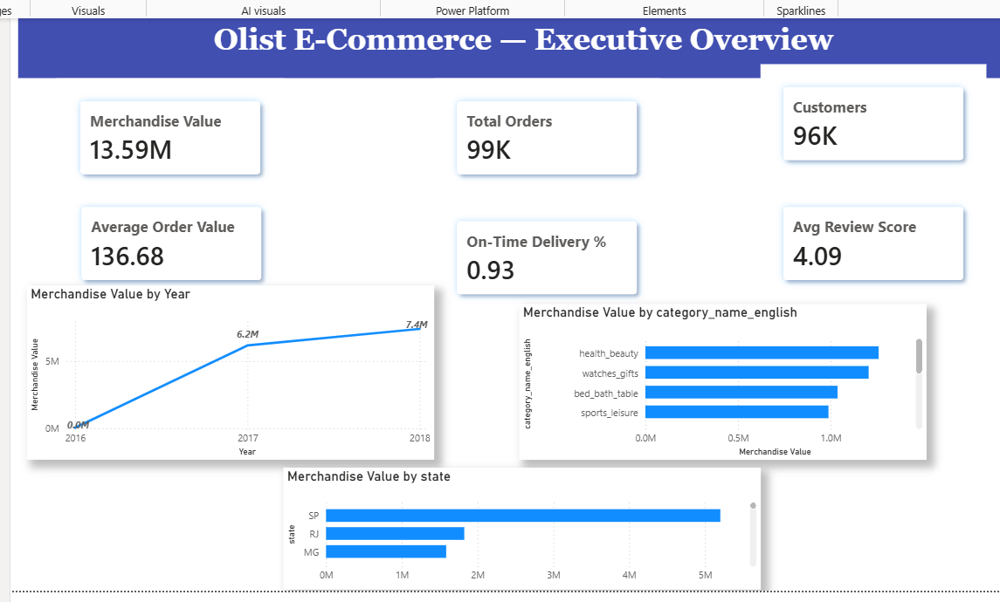
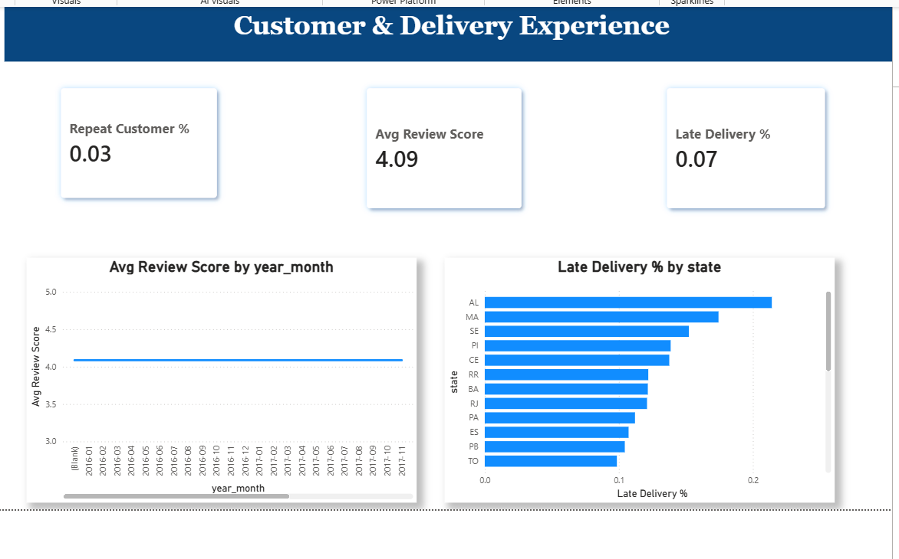
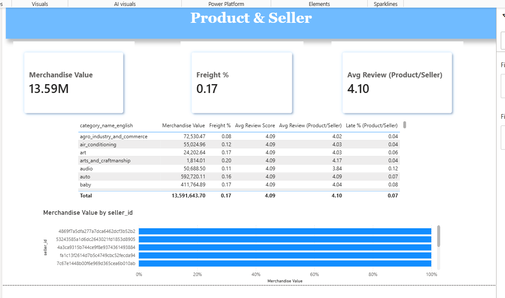
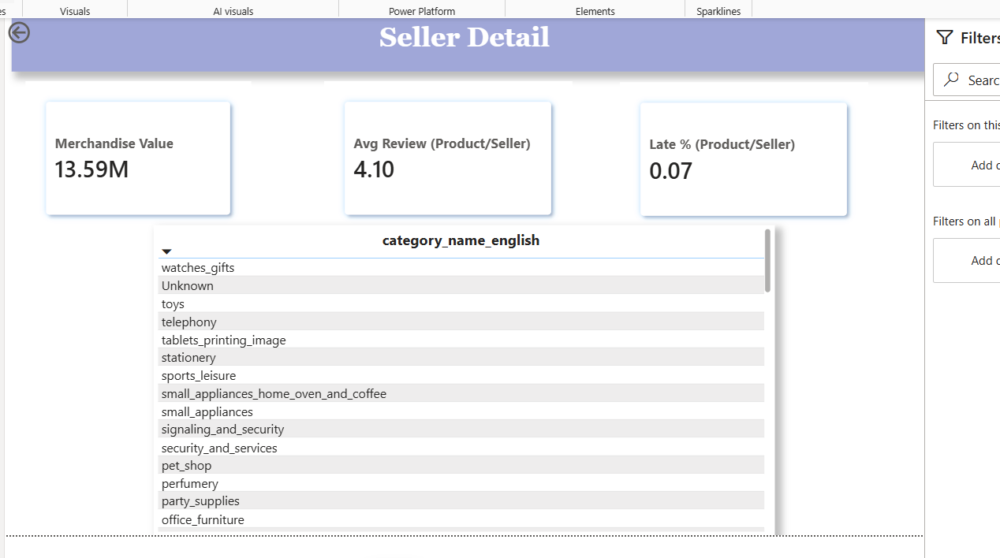

<p align="center">
  
</p>

<p align="center">
  
  
  
  
  
</p>

<p align="center">
  <a href="#-business-problem">Problem</a> •
  <a href="#-architecture">Architecture</a> •
  <a href="#-data-model">Data Model</a> •
  <a href="#-the-fan-out-trap">Fan-out Proof</a> •
  <a href="#-sql-analysis">SQL</a> •
  <a href="#-power-bi-dashboard">Dashboard</a> •
  <a href="#-validation">Validation</a> •
  <a href="#-how-to-run">Run it</a>
</p>

---

## 📌 At a Glance

| 📦 Orders | 👥 Customers | 💰 Merchandise Value | 🚚 Freight | ✅ Reconciled |
|:---:|:---:|:---:|:---:|:---:|
| **99,441** | **96,096** | **R$ 13.59M** | **R$ 2.25M** | **12 / 12 metrics** |

An end-to-end analytics project on the Brazilian **Olist** marketplace dataset: raw CSVs are profiled and cleaned in **Python**, loaded into a validated **SQL Server star schema**, analysed with **advanced T-SQL**, and presented in an interactive **Power BI** dashboard. Every number is traced and reconciled from source to screen.

---

## 🎯 Business Problem

Olist connects small Brazilian sellers to large online marketplaces. Management needs a trustworthy view of:

- **Growth** — how revenue and order volume are trending
- **Customers** — how many are real, how many return, and how concentrated revenue is
- **Delivery** — where orders arrive late, and what lateness costs in customer satisfaction
- **Products & sellers** — which categories and partners drive value, and which are at risk

The hardest part is not the charts. It is making sure the numbers are **right**, because this dataset contains several traps that silently inflate revenue and customer counts.

---

## 🗂️ Dataset

[Brazilian E-Commerce Public Dataset by Olist](https://www.kaggle.com/datasets/olistbr/brazilian-ecommerce) · 9 CSV files · ~1.55M rows · Sep 2016 – Oct 2018

<details>
<summary><b>What one row means in each file (click to expand)</b></summary>

| File | One row represents | Key | Rows |
|---|---|---|---:|
| orders | One order | `order_id` | 99,441 |
| order_items | One product line inside an order | `order_id` + `order_item_id` | 112,650 |
| order_payments | One payment transaction | `order_id` + `payment_sequential` | 103,886 |
| order_reviews | One review | `review_id` *(not unique)* | 99,224 |
| customers | One customer record **per order** | `customer_id` | 99,441 |
| products | One product | `product_id` | 32,951 |
| sellers | One seller | `seller_id` | 3,095 |
| geolocation | One coordinate point for a zip prefix | *none* | 1,000,163 |
| category translation | Portuguese → English category | `product_category_name` | 71 |

</details>

**Source relationships:**

<p align="center">
  
</p>

---

## 🏗️ Architecture

<p align="center">
  
</p>

| Layer | Tool | Responsibility |
|---|---|---|
| Profiling | Python | Row counts, types, nulls, duplicates, key uniqueness, orphans, date ranges |
| Preparation | pandas | Reproducible cleaning with every decision written to a log |
| Staging | SQL Server `stg` | Explicitly typed landing tables, rebuilt on every run |
| Warehouse | SQL Server `dw` | Star schema with primary keys, foreign keys and grain checks |
| Reporting | Power BI | Import-mode model, 20 DAX measures, 4 pages with drill-through |

---

## 🧹 Data Quality

The five most important issues found and how they were handled:

| # | Issue | Records | Action | Why |
|:-:|---|---:|:-:|---|
| 1 | Geolocation has many rows per zip and 261,831 exact duplicates | 1,000,163 → **19,015** | Correct | A many-to-many join would multiply every customer and seller |
| 2 | Some orders have more than one review | **551** removed | Correct | Kept the latest review so reviews join 1:1 to orders |
| 3 | Products with no usable category | **623** | Flag | Labelled *Unknown* instead of deleted, so their revenue is not lost |
| 4 | Missing delivery dates | **2,965** | Retain | These orders were never delivered; filling them would invent deliveries |
| 5 | `customer_id` is per order, not per person | **3,345** overcount | Correct | All customer counting uses `customer_unique_id` |

📄 Full report: [`documentation/data_quality_report.md`](documentation/data_quality_report.md)

---

## ⭐ Data Model

<p align="center">
  
</p>

**Design rules**

- Each fact table lives at **its own grain** and is never joined to another fact
- Every fact carries `customer_key` and `purchase_date_key`, so one slicer filters all four
- All relationships are **many-to-one, single direction**, dimension → fact
- `price`, `freight_value` and `payment_value` are three different measures and are never added together

📄 Metric definitions: [`documentation/metric_definitions.md`](documentation/metric_definitions.md) · Grain: [`documentation/grain.md`](documentation/grain.md)

---

## ⚠️ The Fan-out Trap

An order with 3 items and 2 payments becomes **6 rows** when items and payments are joined, and every price is counted multiple times. Measured on the real data:

| Method | Merchandise Value |
|---|---:|
| ❌ Items joined to payments | R$ 14,209,115.34 |
| ✅ Items only | **R$ 13,591,643.70** |
| **Phantom revenue** | **R$ 617,471.64 (+4.5%)** |

<p align="center">
  
</p>

This single result is why the model uses four separate fact tables.

---

## 🧮 SQL Analysis

Fifteen business questions answered in [`sql/04_business_questions.sql`](sql/04_business_questions.sql).

| Technique | Used in |
|---|---|
| CTEs | Q2, Q4, Q5, Q6, Q9, Q12, Q14 |
| `LAG` / `LEAD` | Q1, Q6 |
| `ROW_NUMBER` · `RANK` · `DENSE_RANK` · `NTILE` | Q6, Q9, Q4, Q14 |
| Running totals | Q2 |
| Conditional aggregation | Q7, Q8, Q12, Q13 |
| Subqueries | Q8, Q9 |
| Date functions · NULL handling | Q6, Q15 · Q5, Q7, Q12, Q15 |

<details>
<summary><b>See all 15 questions</b></summary>

1. How is revenue trending month by month, and how fast is it growing?
2. What is year-to-date revenue at the end of each month?
3. Which ten categories generate the most revenue, and what share does each contribute?
4. Who are the top three sellers by revenue in each state?
5. How many customers come back, and how much revenue do they bring?
6. How long do returning customers wait before their second order?
7. Which states suffer the worst delivery, and does it show in review scores?
8. How much does a late delivery hurt the review score?
9. Which categories earn above-average revenue but below-average ratings?
10. Where is shipping cost heaviest relative to the price of goods?
11. How do customers pay, and does payment method affect spend?
12. Which established sellers have the worst delivery record?
13. How has the cancellation rate moved over time?
14. How concentrated is revenue across the customer base?
15. How accurate are the delivery estimates given to customers?

</details>

### ⚡ Performance Tuning

A filtered dashboard-style query was measured before and after adding two targeted indexes:

| Table | Logical reads before | After | Reduction |
|---|---:|---:|:---:|
| fact_order_items | 1,364 | 163 | **−88%** |
| dim_customer | 1,538 | 65 | **−96%** |
| **Total** | **3,510** | **836** | **−76%** |

CPU time fell from **125 ms to 78 ms**. Logical reads are reported rather than elapsed time, because the first run was reading from a cold cache. 📄 [`sql/performance_test.md`](sql/performance_test.md)

---

## 📊 Power BI Dashboard

<table>
  <tr>
    <td width="50%"><b>Executive Overview</b><br></td>
    <td width="50%"><b>Customer &amp; Delivery</b><br></td>
  </tr>
  <tr>
    <td width="50%"><b>Product &amp; Seller</b><br></td>
    <td width="50%"><b>Seller Detail (drill-through)</b><br></td>
  </tr>
</table>

**Highlights**

- 20 DAX measures including month-over-month growth, year-to-date, and repeat-customer rate
- `TREATAS` carries order-level reviews and delivery into product and seller views **without** a fact-to-fact relationship
- Partial months are excluded from trend charts to avoid a false collapse at each end
- Right-click any seller to drill through to their detail page

---

## ✅ Validation

Twelve metrics reconciled across all three stages:

| Metric | Raw CSV | Python | SQL Server | Status |
|---|---:|---:|---:|:---:|
| Total orders | 99,441 | 99,441 | 99,441 | ✅ |
| Delivered orders | 96,478 | 96,478 | 96,478 | ✅ |
| Cancelled orders | 625 | 625 | 625 | ✅ |
| Order items | 112,650 | 112,650 | 112,650 | ✅ |
| Customers (unique people) | 96,096 | 96,096 | 96,096 | ✅ |
| Sellers | 3,095 | 3,095 | 3,095 | ✅ |
| Products | 32,951 | 32,951 | 32,951 | ✅ |
| Payment records | 103,886 | 103,886 | 103,886 | ✅ |
| Reviews | 99,224 | 98,673 | 98,673 | ⚠️ Expected |
| Merchandise value | 13,591,643.70 | 13,591,643.70 | 13,591,643.70 | ✅ |
| Freight value | 2,251,909.54 | 2,251,909.54 | 2,251,909.54 | ✅ |
| Payment value | 16,008,872.12 | 16,008,872.12 | 16,008,872.12 | ✅ |

The reviews difference is the 551 duplicates removed deliberately. 📄 [`reconciliation/reconciliation.md`](reconciliation/reconciliation.md)

---

## 💡 Key Insights & Recommendations

> 📝 *Complete this section from the results of the 15 SQL questions.*

| # | Insight | Recommendation |
|:-:|---|---|
| 1 | | |
| 2 | | |
| 3 | | |
| 4 | | |
| 5 | | |

---

## ▶️ How to Run

**Requirements:** Python 3, SQL Server (Express is fine), SSMS, ODBC Driver 17 for SQL Server, Power BI Desktop

```bash
# 1. Clone
git clone https://github.com/arifzoha744-ctrl/Ecommerce_Master_Capstone.git
cd Ecommerce_Master_Capstone

# 2. Download the 9 Olist CSVs from Kaggle into raw_data/

# 3. Install packages
pip install pandas pyodbc

# 4. Profile and clean
python python/01_profiling.py
python python/01b_keys.py
python python/02_clean.py
```

```sql
-- 5. In SSMS: create the database
CREATE DATABASE OlistAnalytics;
GO
USE OlistAnalytics;
GO
CREATE SCHEMA stg;
GO
CREATE SCHEMA dw;
GO
```

```bash
# 6. Load staging  (edit SERVER at the top of the script first)
python python/03_load_staging.py
```

7. In SSMS, run `sql/01_create_dimensions.sql`, `02_create_facts.sql`, `03_validate_model.sql` in order
8. Reconcile: `python python/04_reconcile.py`
9. Open `Ecommerce_Master_Capstone.pbix` and refresh

---

## 📁 Repository Structure

```
Ecommerce_Master_Capstone/
├── assets/                  banner, logo, architecture, star schema, screenshots
├── diagrams/                source ERD
├── documentation/           grain, data quality report, metric definitions
├── profiling/               profiling output and summary
├── python/                  profiling, cleaning, loading, reconciliation scripts
├── reconciliation/          three-stage reconciliation report
├── sql/                     schema build, validation, 15 business questions, performance test
├── validation/              fan-out proof and Power BI vs SQL checks
└── Ecommerce_Master_Capstone.pbix
```

---

## 🚧 Limitations

- Data ends in October 2018; the first and last months are partial
- No cost data exists, so the analysis covers revenue, not profit or margin
- Geolocation is averaged to one point per zip prefix, which is accurate at city and state level only
- Only the latest review per order is kept
- Merchandise value excludes freight; payment value includes it and is reported separately

---

<p align="center">
  <br>
  <b>Zoha Khan</b><br>
  <a href="https://github.com/arifzoha744-ctrl">github.com/arifzoha744-ctrl</a>
</p>
